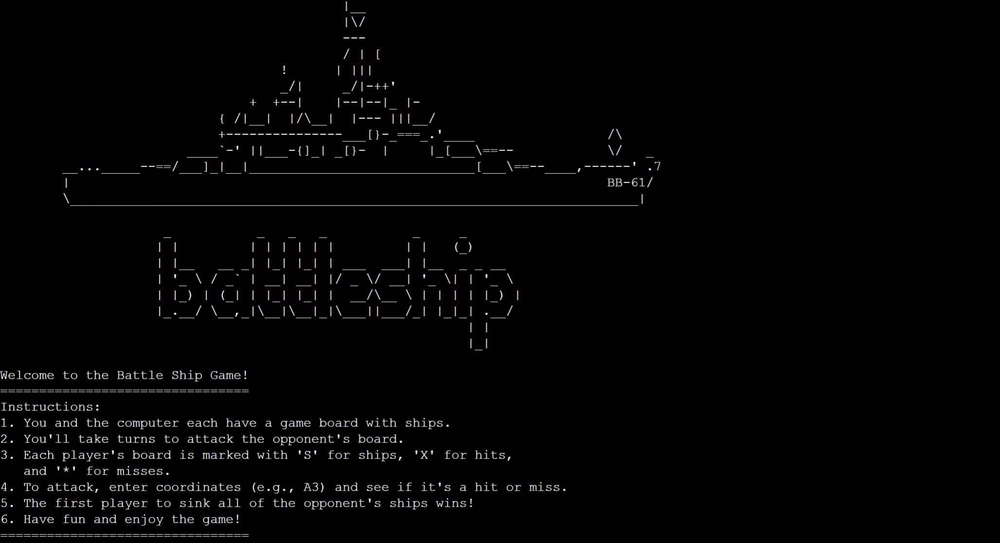
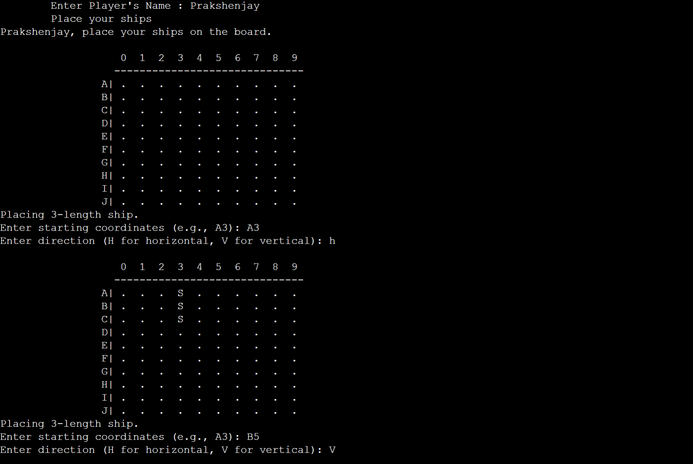
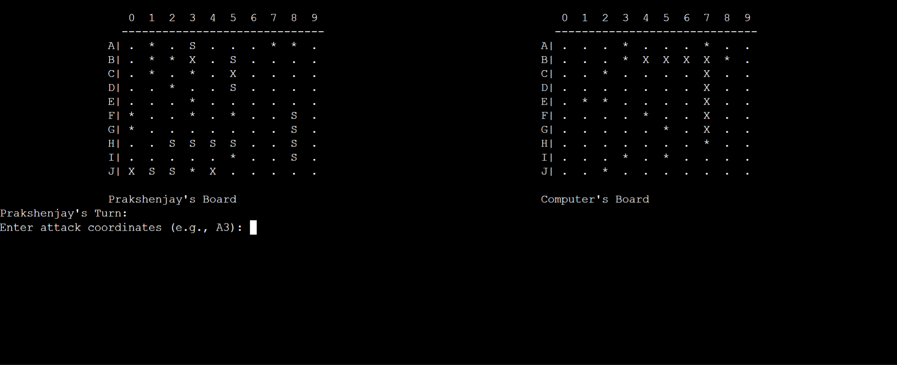

# Battleship Game

                                            |__
                                            |\/
                                            ---
                                            / | [
                                    !      | |||
                                    _/|     _/|-++'
                                +  +--|    |--|--|_ |-
                            { /|__|  |/\__|  |--- |||__/
                            +---------------___[}-_===_.'____                 /\
                        ____`-' ||___-{]_| _[}-  |     |_[___\==--            \/   _
        __..._____--==/___]_|__|_____________________________[___\==--____,------' .7
        |                                                                     BB-61/
        \_________________________________________________________________________|

                     _           _   _   _           _     _       
                    | |         | | | | | |         | |   (_)      
                    | |__   __ _| |_| |_| | ___  ___| |__  _ _ __  
                    | '_ \ / _` | __| __| |/ _ \/ __| '_ \| | '_ \ 
                    | |_) | (_| | |_| |_| |  __/\__ \ | | | | |_) |
                    |_.__/ \__,_|\__|\__|_|\___||___/_| |_|_| .__/ 
                                                            | |    
                                                            |_|  

## Welcome to Battleship Game!

🚀 Welcome to Battleship Game, where you'll embark on epic naval battles against a cunning computer opponent. Engage in strategic warfare as you sink your opponent's fleet and claim victory on the high seas!

## Gameplay

🎮 The Battleship Game is a turn-based strategy game where you and the computer each have a fleet of ships. Take turns attacking each other's boards by selecting coordinates. The first to sink all opponent's ships wins!

## Instructions

📖 To play the game:

1. Run the game.
2. Enjoy the Battleship title screen art!
3. Read through the game instructions to understand the rules.
4. Strategically place your ships on your game board.
5. Take turns attacking your opponent's board by entering coordinates.
6. Sink all the opponent's ships to emerge victorious!

## Screenshots

📸 Here are some important screenshots from the Battleship Game:

### Title Screen

### Setting UP!

### Gameplay

## About the Code

🔍 This project is implemented in C++ and uses a variety of classes and objects to create a dynamic and interactive gameplay experience. The code is organized into separate files for different classes, such as `Game.hpp`, `Player.hpp`, `Computer.hpp`, and more. This approach enhances maintainability and code readability.

## Running the Game

🏁 To run the game:

1. Compile the code using your preferred C++ compiler.
2. Execute the compiled binary.
3. Get ready to dive into exciting naval battles!

## Credits

🙌 ASCII art created by (https://www.asciiart.eu/). Special thanks to the open-source community for contributing to libraries that make this game possible!

## Have Fun and Set Sail!

⚓️ Get ready to strategize, attack, and conquer the high seas! Have a blast playing Battleship Game and show off your naval warfare skills!

---

Feel free to enhance this Project further with additional sections, information, and anything else you want to include. 🎮🌊
